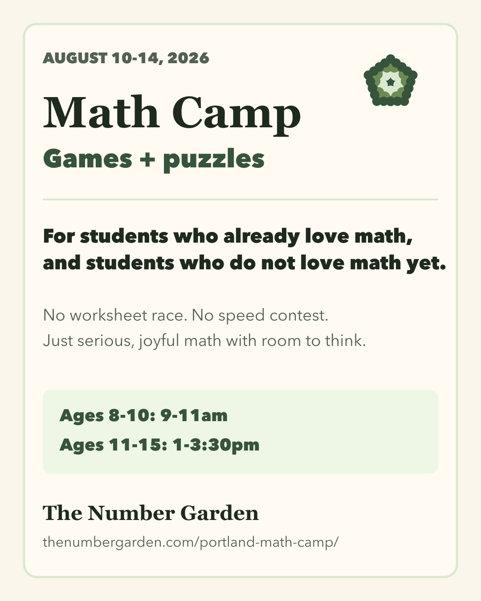
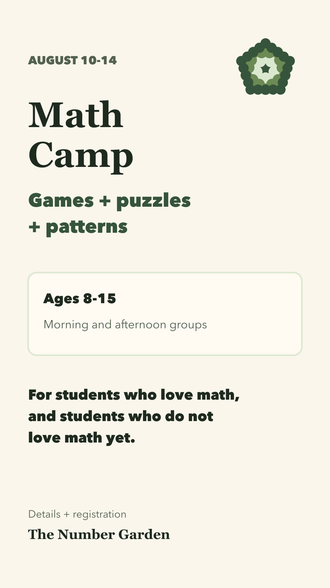
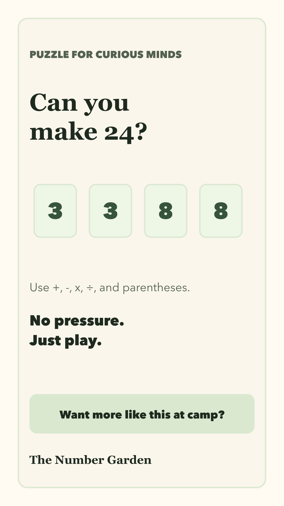
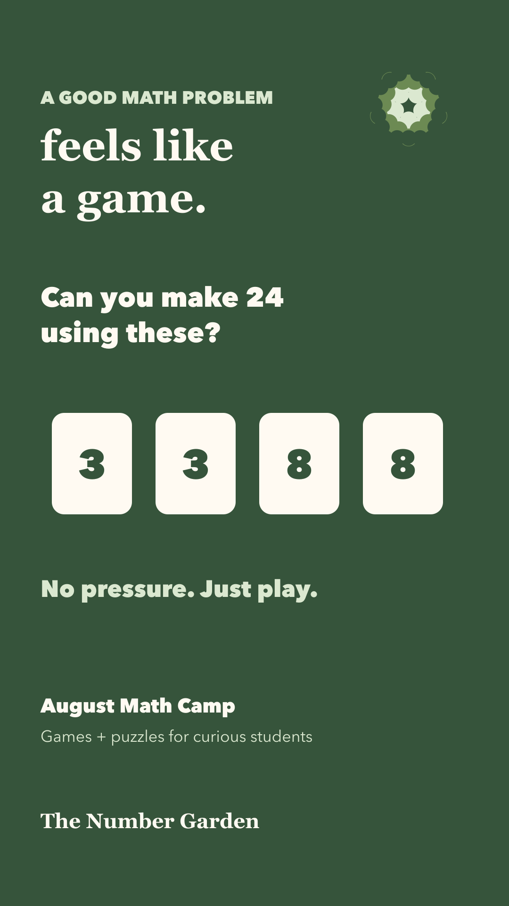

# Week 1 Publish Packet: Camp Launch

Review status: Ready for review

Primary goal: August math camp registration.

Secondary goal: build trust around joyful, inclusive math.

Default link:

`https://thenumbergarden.com/portland-math-camp/`

## Review checklist

- Confirm the inclusive language feels right.
- Confirm that all CTAs should point to the camp landing page.
- Confirm whether the second reel can be a simple prompt/graphic reel, or whether it should wait for phone footage.
- Confirm dates and times:
  - August 10-14, 2026
  - Ages 8-10: 9-11am
  - Ages 11-15: 1-3:30pm

## Visual previews

### Camp invitation feed post

### Camp reminder story

### Puzzle prompt story

### Puzzle reel cover

## Deliverables

### 2026-06-17 - Post - Camp Invitation

- Channels: Instagram feed, Facebook Page
- Asset: `assets/2026-06-17-camp-invitation-feed-4x5.png`
- Source: `assets/2026-06-17-camp-invitation-feed-4x5.svg`
- Captions:
  - `captions/2026-06-17-camp-invitation-instagram.txt`
  - `captions/2026-06-17-camp-invitation-facebook.txt`
- Status: Ready for review

### 2026-06-18 - Story - Camp Reminder

- Channels: Instagram Story, Facebook Story
- Asset: `assets/2026-06-18-camp-reminder-story-9x16.png`
- Source: `assets/2026-06-18-camp-reminder-story-9x16.svg`
- Story text: included in image
- Link sticker: `https://thenumbergarden.com/portland-math-camp/`
- Status: Ready for review

### 2026-06-19 - Reel - Logo Motion Camp Teaser

- Channels: Instagram Reels, Facebook Reels
- Video asset: `media/logo-intro-lab/number-garden-logo-intro-reels-9x16.mp4`
- Reel script: `reel-scripts/2026-06-19-logo-motion-camp-teaser.md`
- Captions:
  - `captions/2026-06-19-logo-motion-camp-teaser-instagram.txt`
  - `captions/2026-06-19-logo-motion-camp-teaser-facebook.txt`
- Status: Ready for review

### 2026-06-20 - Post - Hardy Pattern-Making Quote

- Channels: Instagram feed, Facebook Page
- Asset: `public/generated/social/quotes/hardy-maker-of-patterns/instagram-feed-4x5.png`
- Captions:
  - `captions/2026-06-20-hardy-pattern-making-instagram.txt`
  - `captions/2026-06-20-hardy-pattern-making-facebook.txt`
- Status: Ready for review

### 2026-06-22 - Story - Puzzle Prompt

- Channels: Instagram Story, Facebook Story
- Asset: `assets/2026-06-22-puzzle-prompt-story-9x16.png`
- Source: `assets/2026-06-22-puzzle-prompt-story-9x16.svg`
- Sticker prompt: "Want more like this at camp?"
- Status: Ready for review

### 2026-06-23 - Reel - Puzzle Prompt

- Channels: Instagram Reels, Facebook Reels
- Cover/review asset: `assets/2026-06-23-puzzle-reel-cover-9x16.png`
- Source: `assets/2026-06-23-puzzle-reel-cover-9x16.svg`
- Reel script: `reel-scripts/2026-06-23-puzzle-reel.md`
- Captions:
  - `captions/2026-06-23-puzzle-reel-instagram.txt`
  - `captions/2026-06-23-puzzle-reel-facebook.txt`
- Status: Ready for review; final video can be a phone clip or a simple animated text reel.
